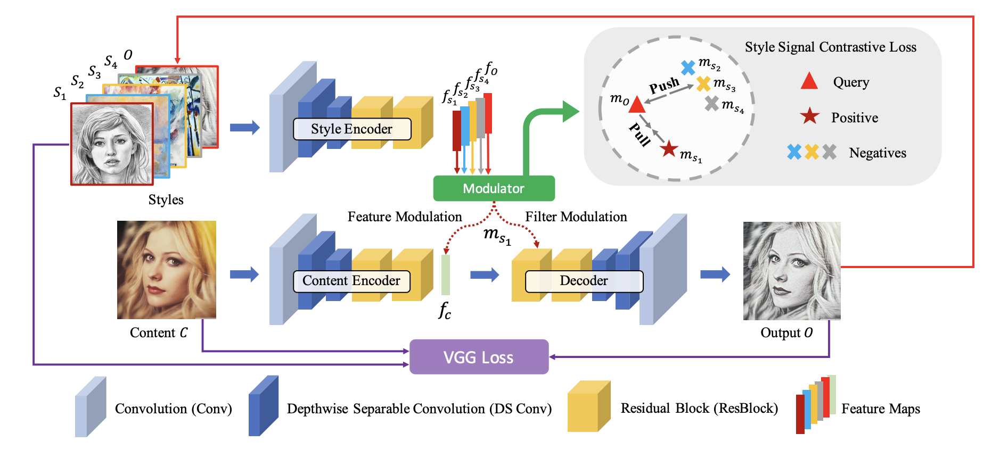
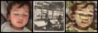
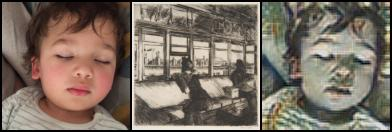
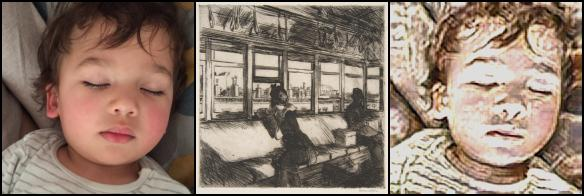
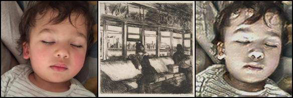

# Concrete-NST (Neural Style Transfer)

This repo contains a *ultra fast* Nerual Style Transfer (NST) solution, encripted with ZAMA's Fully Homomorphic Encryption (FHE) technology for privacy-preserving AI.

Features:
- **Fully End-to-End**: Providing a content image and a style image, the model will generate a stylized image end-to-end, without any manual intervention.
- **Fully FHE-Compatible**: The entire model is FHE-compatible. In other words, the entire NST process is encrypted, ensuring privacy-preserving AI.
- **Quantization-Aware Training**: The model is trained with Quantization-Aware Training (QAT) to ensure compatibility with FHE.
- **Ultra Fast**: We provide three sizes of models to achieve `low`, `mid`, and `high` quality, to balance between speed and quality. For the `low` quality model, the inference time is less than 3 hours on a modern CPU (3236992 PBS). For the `high` quality model, the inference time is less than 25 hours on a modern CPU (28349568 PBS).
- **High Resolution**: For the `high` quality model, we can process images up to 192x192 pixels.
- **Contain Training Scripts**: We provide pretrained weights for models, as well as training scripts to reproduce the results.

## Methodology

We first design a light-weight model with encoder-decoder architecture. 
Both the encoder and the decoder are convolutional neural networks (CNN) for less computational overhead and parameters. 
The model is designed with Brevitas for latter Quantization-Aware Training (QAT) and FHE compatibility. 
Specifically, since Concrete-ML does not support `resize` operator for now, we implement a FHE-compatible Upsampling Layer, which is crucial for the decoder.

Then, we follow a recent State-of-the-Art (SOTA) NST methods on AAAI 2023, [MicroAST](https://arxiv.org/pdf/2211.15313), to design the loss function for training.

Specifically, we use a combination loss consisting of a content loss, a style loss, and a novel style signal contrastive (SSC) loss to train the model. 
The content loss measures the distance between extracted features of the styled image by our model and the extracted feature of the original content image using a pretrained VGG model on ImageNet (This pretrained VGG model can be downloaded from TorchVision), to ensure that the styled image preserves the content and structure of the content image.
Formally, the content loss $L_c$ is defined as:

$$ L_c = MSE(vgg(decoder(encoder_c(X_c), encoder_s(X_s))), vgg(X_c)), $$

where $MSE$ is the mean squared error, $vgg$ is the pretrained VGG model, $X_c$ is the content image, $X_s$ is the style image, and $encoder_c$, $encoder_s$, $decoder$ are the content encoder, style encoder and decoder of our model, respectively.
Next, the style loss $L_s$ ensures that the styled image has the same distribution of features as the style image.
Formally, the style loss $L_c$ is defined as:

$$ L_s = MSE(mean(vgg(decoder(encoder_c(X_c), encoder_s(X_s)))), mean(vgg(X_s))) + MSE(var(vgg(decoder(encoder(X_c), encoder_s(X_s)))), var(vgg(X_s))), $$

where $mean$ and $var$ are the mean and variance of the features, respectively.
Finally, the SSC loss $L_{ssc}$ is designed to help boost the ability of the style encoder to extract more distinct and representative modulation signals for each style by contrastive learning:

$$ L_{ssc} = \sum_{i=1}^N \frac{|| m_{o,i} - m_{s, i} ||^2}{ \sum_{j \neq i}^N } || m_{o,i} - m_{s, j} ||^2, $$

where $m_{o,i}$ and $m_{s,i}$ are intermediate features of the the $i$-th styled and style image, respectively, and $N$ is the batch size.
Finally, the total loss is defined as:

$$ L = \lambda_c L_c + \lambda_s L_s + \lambda_{ssc} L_{ssc}, $$

where $\lambda_c$, $\lambda_s$ and $\lambda_{ssc}$ are hyper-parameters to balance the three losses.
Note that due to higher computational overhead of variance calculation, we simply the variance calculation by using the mean of the absolute difference between the features.

The training is conducted on the COCO-2014 dataset and the WikiArt dataset.
The COCO-2014 dataset contains 83k training images, while the WikiArt dataset contains 42k training images.

After training, models will be compiled into FHE-compatible models, and then evaluated using FHE.

## Installation

> Note that you might need to install the `concrete-ml` from the source code, as the released version (v1.6.1) does not support encrypted `mul` and `div` yet.
> 
> Please make sure that the `concrete-ml` you installed has merged this [PR](https://github.com/zama-ai/concrete-ml/pull/690) to support encrypted `mul` and `div`.

### For Inferencing

1. Install dependencies using `pip install -r requirements.txt`.
2. Prepare your content image and style image.
3. Follow `python run.py --content <CONTENT-IMAGE-PATH> --style <STYLE-IMAGE-PATH> --quality <high|mid|low>` to run the model. Note that all pretrained weights we provided are trained with 4x NVIDIA 4090 GPU for 30 days.

### For Training

1. Install dependencies using `pip install -r requirements.txt`.
2. Download the [COCO-2014](https://cocodataset.org/#download) dataset and [WikiArt](https://www.kaggle.com/c/painter-by-numbers) dataset.
3. Download the pretrained VGG model from [Here](https://drive.google.com/file/d/1PUXro9eqHpPs_JwmVe47xY692N3-G9MD/view?usp=sharing).
4. Run `python train.py --content_dir <COCO-2014-DIR> --style_dir <WIKIART_DIR> --vgg <VGG_WEIGHT_PATH> --quality <high|mid|low> --content_weight 2.0 --lr_decay 1e-5 --max_iter 640000 --device cuda:0` to train the model (The training takes approximately 30 days with one NVIDIA 4090 GPU).

## Performance

> Note that the following performance is tested only for reference. Depending on the hardware, downstream tasks, and set parameters, the performance may vary significantly.

Hardware: M1 MAX, 64GB RAM

Number of Samples: 1

|                      | large     | mid       | tiny     |
|----------------------|-----------|-----------|----------|
| Inference Time (FHE) | ~25 Hours | ~10 Hours | ~3 Hour  |
| PBS                  | ~28349568 | ~12684416 | ~3236992 |

Low Quality Model (64x64):

Mid Quality Model (128x128):

High Quality Model (192x192):

Reference (192x192):

